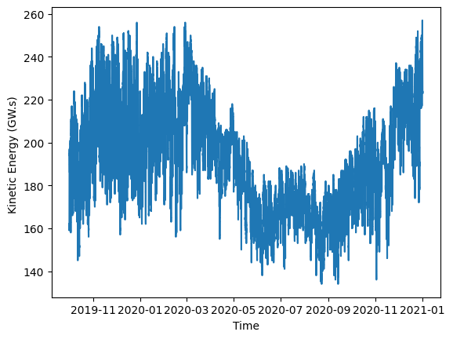
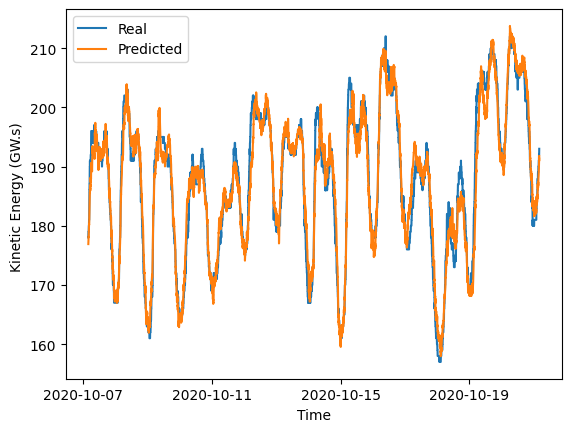

## A Machine Learning-Based Methodology for Short-Term Kinetic Energy Forecasting with Real-Time Application: Nordic Power System Case

### Abstract
The progressive substitution of conventional synchronous generation for renewable-based generation imposes a series of chal-
lenges in many aspects of modern power systems, among which are the issues related to the low rotational inertia systems. Ro-
tational inertia and the kinetic energy stored in the rotating masses in the power system play a fundamental role in the operation
of power systems as it represents in some sort the ability of the system to withstand imbalances between generation and demand.
Therefore, transmission system operators (TSOs) need tools to forecast the inertia or the kinetic energy available in the systems in
the very short term (from minutes to hours) in order to take appropriate actions if the values fall below the one that ensures secure
operation. This paper proposes a methodology based on machine learning (ML) techniques for short-term kinetic energy forecast-
ing available in power systems; it focuses on the length of the moving window, which allows for obtaining a balance between the
historical information needed and the horizon of forecasting. The proposed methodology aims to be as flexible as possible to apply
to any power system, regardless of the data available and the software used. To illustrate the proposed methodology, time series
of the kinetic energy recorded in the Nordic Power System (NPS) has been used as a case study. The results show that Linear
Regression (LR) is the most suitable method for a time horizon of one hour due to its high accuracy-to-simplicity ratio, while
Long Short-Term Memory (LSTM) is the most accurate for a forecasting horizon of four hours. Experimental assessment has been
carried out using Typhoon HIL-404 simulator, verifying that both algorithms are suitable for real-time simulation.

#### Single experiment with LR or LSTM model

A useful script is provided in [experiments/keforecasting.py](experiments/keforecasting.py) that allows reproducing the results obtained in our work.
This script includes all the steps to reproduce the proposed methodology: preprocessing steps (train/test data split, data normalization, etc.), the model and hyper-parameter selection (LSTM or LinearRegression model, past history window, forecasting horizon, etc.), and the reporting of the evaluation metric. It also includes
useful functions for plotting the predictions.

#### Grid search

The grid search study can be conducted using the provided [run.sh](run.sh) script, which uses the [experiments/main.py](experiments/main.py) script with different configurations for forecasting horizon and past history window.